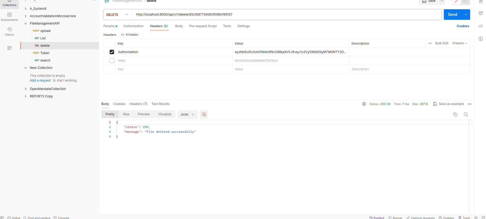
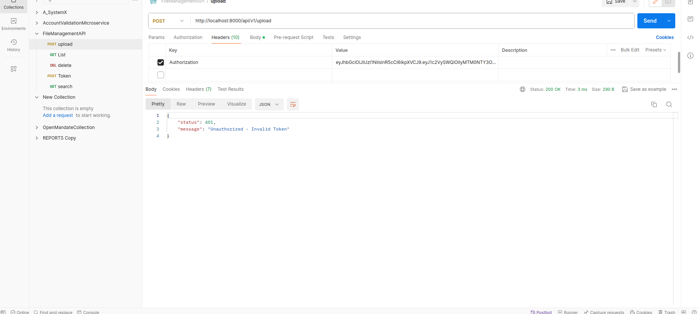
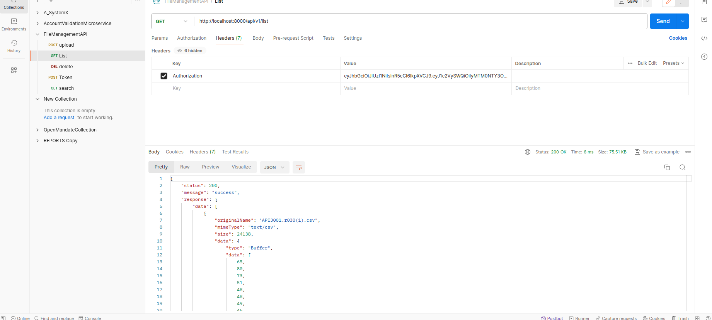
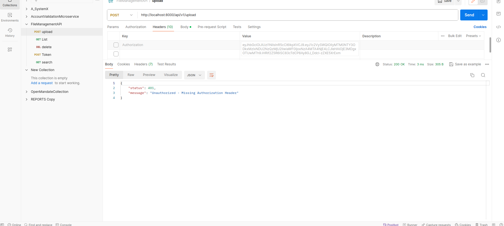
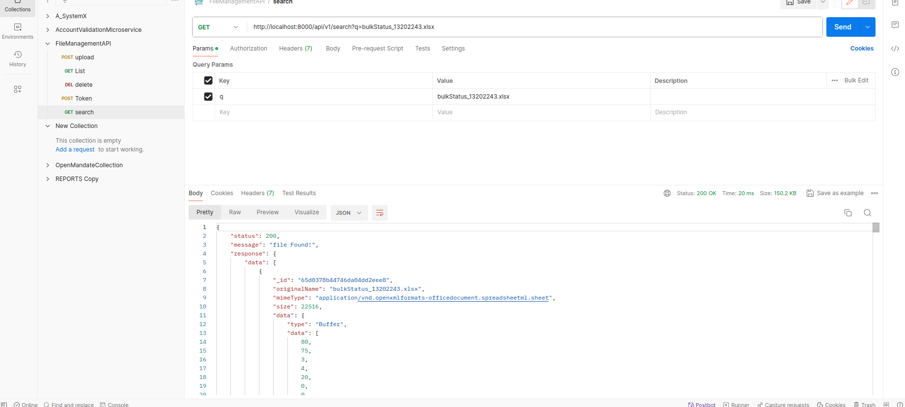
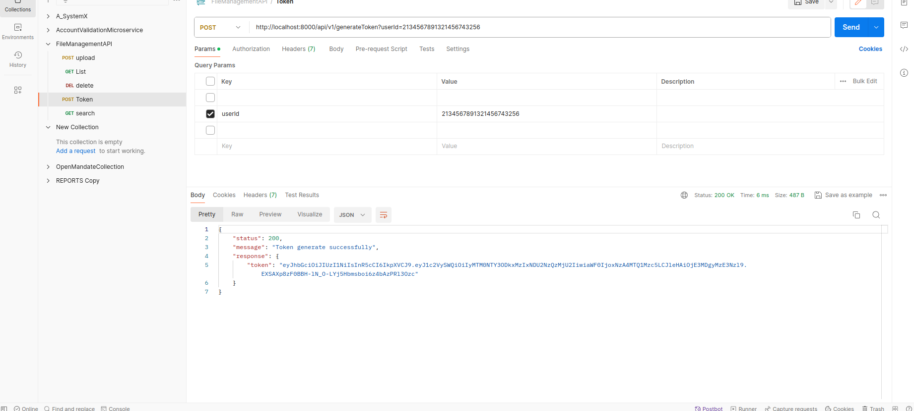
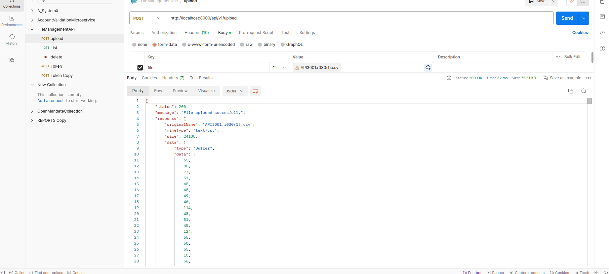
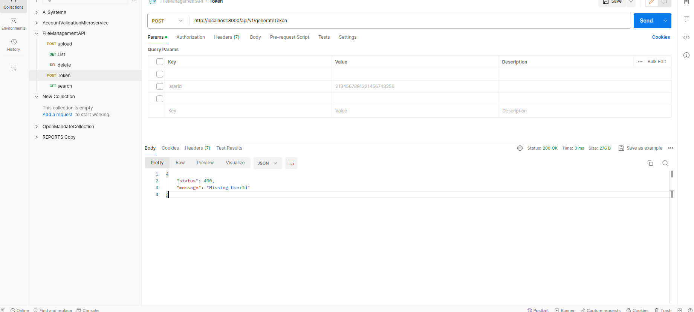

# Installation
1. Clone the repository:
git clone https://github.com/chaitanyapatil598/file-management-api.git

2. Navigate to the project directory:
   cd file-management-api

3. Install dependencies:
   npm install

# Usage
1. Start the application:
   npm run start:dev

2. The API will be accessible at http://localhost:8000 by default.

API Endpoints
-Upload File
    Method: POST
    Endpoint: /upload
    Authentication: Required (authenticationMiddleware)
    Body: Form-data with a single file field named 'file'

-List Files
    Method: GET
    Endpoint: /list
    Authentication: Required (authenticationMiddleware)

-Delete File

    Method: DELETE
    Endpoint: /delete/:fileId
    Authentication: Required (authenticationMiddleware)
    Parameters: fileId (ID of the file to delete)

-Generate Token

    Method: POST
    Endpoint: /generateToken
    Body: JSON with userId and userName
    Note: This endpoint requires user authentication.

-Search Files

    Method: GET
    Endpoint: /search
    Authentication: Required (authenticationMiddleware)
    Query Parameter: q (Search query)

Notes

    Make sure to provide valid authentication details for protected endpoints.
    Screenshots or expected API responses can be added here.

         